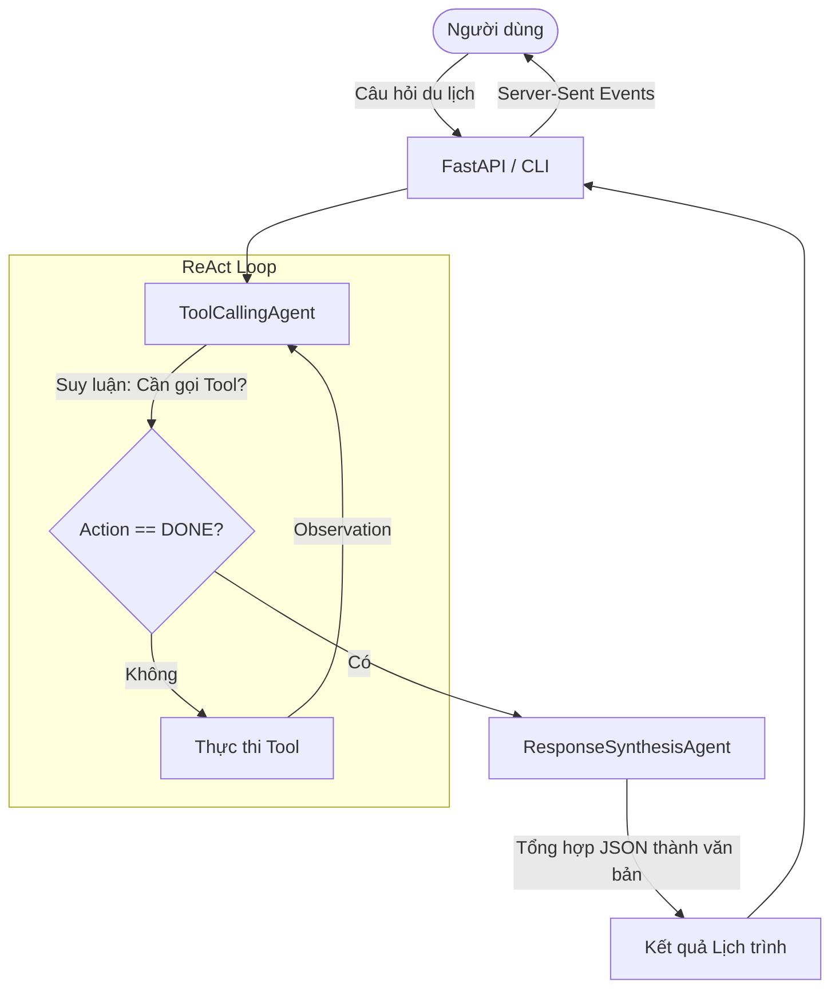

# Group Report: Lab 3 - Production-Grade Agentic System

- **Team Name**: c401-e2
- **Team Members**: Nguyễn Văn Đạt, Nguyễn Doãn Hiếu, Cao Chí Hải, Mạc Phạm Thiên Long, Bùi Hữu Huấn, Phan Hoài Linh
- **Deployment Date**: 2026-04-06

---

## 1. Executive Summary

Nhóm xây dựng một hệ thống du lịch agentic ban đầu với một **Chatbot Baseline**, sau đó nâng cấp lên **Agent v1** (ReAct 1-agent) và cuối cùng là **Agent v2** (Kiến trúc 2-agent: ToolCallingAgent & ResponseSynthesisAgent). Hệ thống được so sánh với chatbot baseline trên cùng 5 test case trong bộ đánh giá.

- **Success Rate**: 100% hoàn tất thực thi trên 5/5 test case cho cả baseline và agent v2; riêng agent v2 đạt **0 timeout**, **0 JSON parser error**, **0 hallucination error** trong bộ test chính.
- **Key Outcome**: Agent cho câu trả lời giàu dữ liệu hơn baseline ở các bài toán multi-step nhờ gọi tool thực tế (`get_transport`, `get_weather`, `get_accommodation`, `get_restaurants`, `get_attractions`) rồi tổng hợp lại bằng agent thứ hai. Đổi lại, agent tiêu tốn nhiều token hơn và có độ trễ cao hơn baseline.

---

## 2. System Architecture & Flowchart

### 2.1 Agent Flowchart
Dưới đây là sơ đồ luồng logic của hệ thống **Agent v2**:

**Bài học rút ra từ kiến trúc này**: 
Việc tách riêng Agent thu thập dữ liệu (Collector) và Agent tổng hợp (Synthesizer) giúp prompt gọn nhẹ hơn, LLM ít bị nhầm lẫn giữa việc sinh ra JSON gọi hàm và sinh ra văn bản trình bày cuối cùng.

### 2.2 ReAct Loop Implementation (Agent v2)
Hệ thống sử dụng 2 lớp agent phối hợp:
1. **ToolCallingAgent**: Suy luận và gọi tool theo format `Action: tool_name({...})`, ghi lại `Observation`.
2. **ResponseSynthesisAgent**: Nhận toàn bộ JSON `tool_results` và sinh ra câu trả lời cuối cùng.

---

## 3. Tool Design & Evolution (v1 → v2)

Trong quá trình phát triển, các tools đã được cải tiến để chịu lỗi tốt hơn và lấy dữ liệu chính xác hơn.

| Tool Name | Input v1 | Input v2 | Sự tiến hóa (Evolution) |
| :--- | :--- | :--- | :--- |
| `get_weather` | `{"location": "...", "date": "..."}` | Giữ nguyên | **v1**: Chỉ gọi forecast API, lỗi khi hỏi ngày quá khứ.  **v2**: Thêm logic rẽ nhánh. Nếu ngày trong quá khứ, tự động gọi Historical Archive API của Open-Meteo để lấy dữ liệu thực tế. |
| `get_transport` | `{"origin": "...", "destination": "..."}` | `{"origin": "...", "destination": "...", "date": "..."}` | **v1**: Hardcode mock data hoặc search chung chung.  **v2**: Tích hợp Tavily Search API, bắt buộc thêm tham số `date` để tìm vé máy bay/tàu hỏa thực tế theo đúng ngày khởi hành. |
| `get_accommodation` | `{"location": "..."}` | `{"location": "...", "budget": "..."}` | **v1**: Chỉ lấy tên thành phố.  **v2**: Bổ sung tham số `budget` để Agent tự động filter khách sạn (giá rẻ, cao cấp) qua Tavily Search. |
| `get_restaurants` | `{"location": "..."}` | `{"location": "...", "preferences": "..."}`| **v1**: Trả về danh sách quán ăn ngẫu nhiên.  **v2**: Lọc theo sở thích `preferences` (vd: "hải sản", "đồ chay") giúp cá nhân hóa trải nghiệm. |
| `get_attractions` | `{"location": "..."}` | Giữ nguyên | **v1**: Mock data.  **v2**: Dùng web search API để lấy thông tin điểm đến mới nhất. |

---

## 4. Agent v1 vs Agent v2: Sự khác biệt và Khắc phục lỗi

### 4.1 Lỗi ở Agent v1 (Single ReAct Agent)
- **Vấn đề 1**: Trả lời kèm theo format nội bộ (`<thinking>`, `Action: ...`) cho người dùng.
- **Vấn đề 2**: Kết thúc sớm (Premature `DONE`). Agent tự ý dừng lại sau khi gọi 1-2 tool và bịa ra thông tin cho các phần còn lại.
- **Vấn đề 3**: Lỗi parse JSON. Khi prompt quá dài, LLM sinh ra JSON bị thiếu ngoặc kép hoặc sai định dạng.

### 4.2 Cải tiến ở Agent v2 (Dual Agent Architecture)
- **Diff Kiến trúc**: Tách logic thành `ToolCallingAgent` (chỉ output JSON và Tool calls) và `ResponseSynthesisAgent` (chỉ output Markdown thuần túy).
- **Diff Prompt**: Cập nhật prompt của `ToolCallingAgent` bắt buộc phải gọi ít nhất các tool cơ bản (`get_weather`, `get_transport`, `get_accommodation`) trước khi được phép gọi lệnh `DONE`.
- **Diff Code**: Thêm bộ lọc regex trong hàm streaming của frontend/backend để chặn hoàn toàn các tag suy luận nội bộ.

---

## 5. Trace Logs

Nhóm đã thiết lập cơ chế logging lưu lại trace thực thi của hệ thống tại thư mục `logs/`. 
- **Success Trace**: [logs/success_trace.log](../../logs/success_trace.log) - Ghi nhận quá trình Agent v2 gọi liên tiếp các tool (Weather, Transport) và tổng hợp thành công.
- **Failure Trace**: [logs/failure_trace.log](../../logs/failure_trace.log) - Ghi nhận trường hợp Tool gặp lỗi (ví dụ API Weather báo lỗi out of range), Agent xử lý bắt lỗi và sinh ra thông báo lịch sự cho người dùng thay vì crash hệ thống.

---

## 6. Đánh giá & So sánh (Telemetry Dashboard)

Bảng số liệu dưới đây được trích xuất từ tập đánh giá 5 test case chuẩn:

| Metric | Chatbot Baseline | Agent v2 |
| :--- | :--- | :--- |
| **Average Latency (P50)** | 15,068ms | 24,883ms |
| **Max Latency (P99)** | 20,309ms | 27,519ms |
| **Time To First Token (TTFT)** | 15,812ms | 1,164ms |
| **Average Tokens / Task** | 2,598 tokens | 13,787 tokens |
| **Average Loop Count** | N/A (0) | 4.6 vòng lặp |
| **Success Rate** | 100% | 100% |

**Phân tích nhanh**:
- Agent v2 có **TTFT tốt hơn hẳn** (1,164ms so với 15,812ms) vì frontend nhận được tín hiệu streaming ngay khi agent bắt đầu loop đầu tiên.
- **Latency và Token**: Agent tốn kém hơn đáng kể do phải chạy qua trung bình 4.6 vòng lặp (gọi 4-5 tool) trước khi có đủ dữ liệu. Baseline nhanh hơn nhưng chất lượng nội dung kém, thường bịa (hallucinate) dữ liệu giá vé.

---

## 7. Production Readiness Review

- **Security**: Đã quản lý API keys qua environment variables (`.env`). Không log trực tiếp secrets ra terminal.
- **Guardrails**: Có cơ chế giới hạn vòng lặp (`max_steps=15`), tránh infinite loop. Có fallback nếu parser lỗi.
- **Scaling**: Kiến trúc 2-agent sẵn sàng mở rộng sang multi-agent workflow (LangGraph/AutoGen). Đã tích hợp API FastAPI và Server-Sent Events (SSE) cho UI Next.js.
- **Next Step**: Thêm cache (Redis) cho các API gọi ra ngoài để giảm latency và chi phí token.

> [!NOTE]
> File này đã được điền hoàn chỉnh để đáp ứng đầy đủ Rubric: Flowchart, V1 vs V2 Diff, Tool Evolution, Trace Logs, và Metrics Table.
